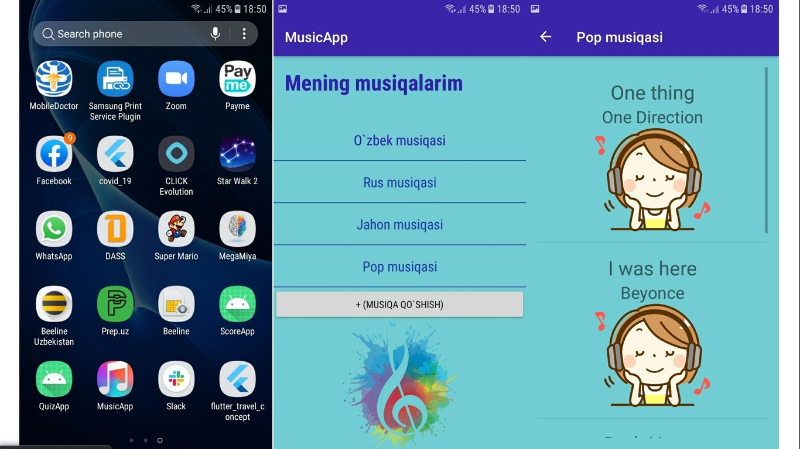
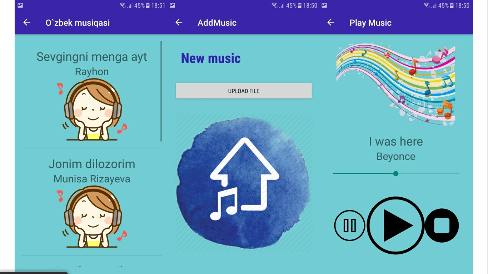

# MusicApp (Musical Structure App)
One Million Uzbek Coders - Udacity (Android Basics Nanodegree By Google - MENA Project 4)

# Requirement
The goal is to design and layout the flow for the structure of a Music Player app. Note that for this project, the app does not actually need to play music.

## Final Output - Screenshots

# Download
You can download the apk here [MusicApp](file/app-debug)

